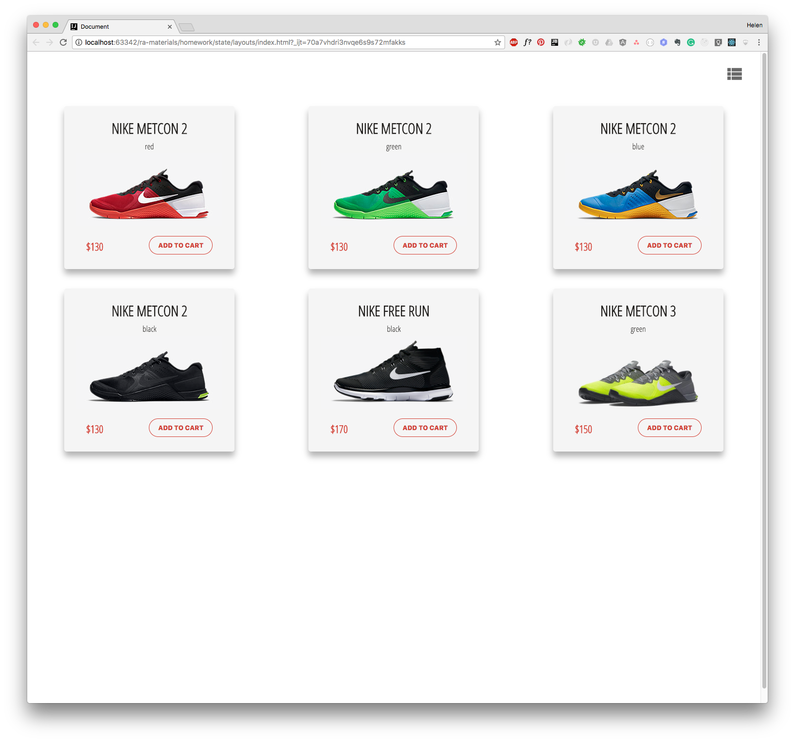

[](https://github.com/professor-severus-snape/view-toggle/actions/workflows/vite_ci-cd.yml)

# Переключение отображения товаров

Небольшое React-приложение для отображения товаров интернет-магазина с возможностью переключения между карточным и списочным видом.



## Демо

Посмотреть демо можно [здесь](https://professor-severus-snape.github.io/view-toggle/).

## Возможности

- переключение между двумя режимами отображения:
  - список (`ListView`)
  - сетка (`CardsView`)
- динамическое обновление интерфейса
- управление состоянием отображения
- разделение логики и презентационных компонентов

## Архитектура компонентов

- `Store` — stateful компонент
  - управляет текущим видом отображения через state

- `IconSwitch` — презентационный компонент
  - отображает иконку текущего режима
  - обрабатывает переключение

- `CardsView`
  - отображает товары в виде сетки (`ShopCard`)

- `ListView`
  - отображает товары списком (`ShopItem`)

## Пример использования

```jsx
<IconSwitch
  icon={"view_list"}
  onSwitch={() => console.log("change layout")}
/>
```

## Технологии

- React 18
  - JSX
  - functional components
  - props
  - useState
  - обработка событий
- типизация - propTypes
- линтинг - ESLint 
- сборка - Vite

## CI/CD

- GitHub Actions - линтинг и сборка проекта (CI)
- GitHub Pages - автоматический деплой приложения (CD)
